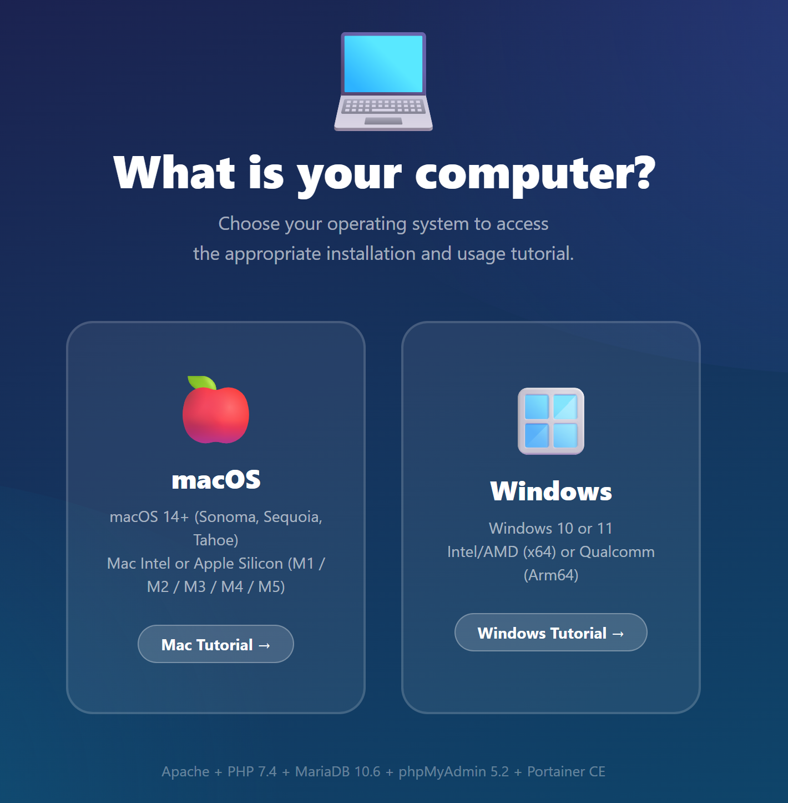

<p align="center">
  
</p>

<h1 align="center">PHP Docker Environment — macOS</h1>

<p align="center">
  <strong>XAMPP equivalent — ready to use, zero configuration.</strong><br>
  Apache 2.4 · PHP 7.4 · MariaDB 10.6 · phpMyAdmin · Portainer
</p>

<p align="center">
  
  
  
  
</p>

---

## Setup — 3 steps

### 1. Install Docker Desktop (once)

Download and install [Docker Desktop](https://www.docker.com/products/docker-desktop) for macOS.

### 2. Download this project

**Option A — Without Git (beginners)**

1. On this page, click the green **`<> Code`** button (top right)
2. Click **`Download ZIP`**
3. Open the downloaded ZIP file
4. **Extract** (unzip) the folder to your **Desktop**
5. Name the folder **`PHPenv`**

**Option B — With Git**

```bash
cd ~/Desktop
git clone https://github.com/selinachegg/php-docker-environment_macOS.git PHPenv
```

### 3. First-time setup (one command)

Open **Terminal** and paste this command:

```bash
cd ~/Desktop/PHPenv && bash install.sh
```

This removes macOS security blocks, sets permissions, and checks Docker. **You only need to do this once.**

> After running `install.sh`, you can double-click any `.command` file without issues.

---

## Launch

**Launcher (recommended)** — Double-click `launcher.command` for an interactive menu:

```
  1)  Start
  2)  Stop
  3)  Restart
  4)  Reset Portainer
  5)  Quit
```

The launcher **automatically starts Docker Desktop** if it's not running — no need to open it manually.

Individual scripts are also available: `start.command`, `stop.command`, `reset-portainer.command`.

The first launch takes **5 to 10 minutes** (downloading images). After that: **~10 seconds**.

---

## Your services

| Service | URL | Description |
|---------|-----|-------------|
| PHP Site | [localhost:8080](http://localhost:8080) | Your PHP files (`htdocs/` folder) |
| phpMyAdmin | [localhost:8081](http://localhost:8081) | Visual database management |
| Portainer | [localhost:9000](http://localhost:9000) | Visual Docker container management |
| Dashboard | [localhost:8082](http://localhost:8082) | Home page with all links |

---

## Working with PHP

Your PHP files go in the **`htdocs/`** folder. Changes are **instant** — no restart needed.

```php
<?php
// htdocs/hello.php → http://localhost:8080/hello.php
echo "Hello world!";
?>
```

### Database connection

```php
<?php
$pdo = new PDO(
    "mysql:host=db;dbname=app;charset=utf8mb4",
    "app",   // username
    "app"    // password
);
?>
```

| Parameter | Value |
|-----------|-------|
| Host | `db` |
| Database | `app` |
| Username | `app` |
| Password | `app` |
| Root password | `root` |

---

## Full tutorial

Open the [**Interactive tutorial (HTML)**](tutorials/STUDENT-TUTORIAL.html) in your browser for the complete step-by-step guide.

PDF version: [Tutorial Mac (PDF)](tutorials/Tutorial%20%E2%80%94%20PHP%20Docker%20Environment%20Mac.pdf)

---

## macOS security — what `install.sh` fixes

| Problem | Cause | What the script does |
|---------|-------|---------------------|
| "Cannot be opened because it is from an unidentified developer" | macOS Gatekeeper quarantine flag on downloaded files | Runs `xattr -cr .` to remove quarantine from all files |
| "Permission denied" when double-clicking `.command` | Files not marked executable after ZIP extraction | Runs `chmod +x *.command` |
| Docker not running | Students forget to open Docker Desktop first | The launcher auto-detects and launches Docker Desktop, then waits until it's ready |

> **If you skip `install.sh`**: Right-click on `launcher.command` → "Open" → click "Open" in the dialog. macOS remembers this choice.

---

## Quick troubleshooting

| Problem | Solution |
|---------|----------|
| Portainer shows "timeout" | Use **Reset Portainer** in the launcher (option 4), or double-click `reset-portainer.command`. Then go to localhost:9000 immediately. |
| Docker is not running | The launcher starts it automatically. If it fails, open Docker Desktop manually. |
| localhost:8080 not responding | Wait 30 seconds (database starts last) then refresh. |
| phpMyAdmin connection error | MariaDB takes 10-20s to start. Wait and refresh. |
| "Permission denied" | Run `chmod +x *.command` in Terminal, or re-run `bash install.sh`. |
| Full reset | `docker compose down -v` then start again |

---

## Tech stack

- **PHP** 7.4 — PDO, MySQLi, GD, ZIP, MBString, OPcache
- **Apache** 2.4 — mod_rewrite enabled
- **MariaDB** 10.6 — 100% MySQL compatible
- **phpMyAdmin** 5.2
- **Portainer** Community Edition
